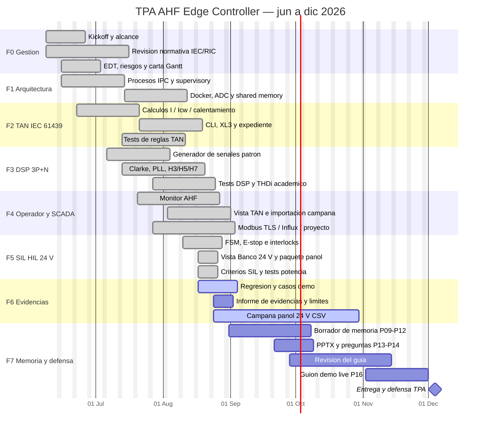

# Carta Gantt del TPA

**Proyecto:** Controlador de borde para filtro activo de armónicos (AHF)
**Repositorio:** `snocomm-edge-controller`
**Periodo:** 08-jun-2026 — 06-dic-2026 (26 semanas)
**Fecha de estado:** 23-ago-2026
**Avance ponderado:** 84 %

Documento de programación del Trabajo Práctico Aplicado. El PDF de entrega es `CARTA_GANTT_TPA.pdf` (A3 apaisado, 3 láminas). El CSV `CARTA_GANTT_TPA.csv` importa a Excel o LibreOffice Calc (separador `;`).

## Alcance que programa esta carta

**Autor:** Andres Barbudo Rodriguez  
**Institución:** CFT Paillaco

Preingeniería de tableros BT (IEC 61439 / TAN), DSP 3P+N sobre señales patrón y validación SIL del banco 24 V (KPS305D). **Hoy calcula y simula; no mide con instrumento certificado ni inyecta corriente.**

## Gantt (Mermaid)

## Hitos

| ID | Hito | Fecha | Estado |
|---|---|---|---|
| M1 | Alcance TPA congelado | 21-jun-2026 | Cumplido |
| M2 | TAN-Telecom operable | 26-jul-2026 | Cumplido |
| M3 | DSP validado con patrones | 16-ago-2026 | Cumplido |
| M4 | Plataforma de 3 vistas integrada | 21-ago-2026 | Cumplido |
| M5 | HIL SIL cerrado (sin salidas físicas) | 21-ago-2026 | Cumplido |
| M6 | Paquete de evidencias TPA | 23-ago-2026 | Cumplido |
| M7 | Borrador de memoria | 23-ago-2026 | Cumplido |
| M8 | Defensa del TPA | 04-dic-2026 | Pendiente |

## Ruta crítica

`0.1 → 0.2 → 2.1 → 3.2 → 4.1 → 5.1 → 6.1 → 7.1 → 7.4`

La ruta crítica del TPA es la cadena **problema eléctrico → señal patrón → cálculo auditable → lógica segura → evidencias → memoria**. No es el producto de 400 V. F6.3 (CSV pañol) es PLUS y no bloquea la memoria.

## Ritmo medido (21-ago-2026)

- 6 de 16 prompts (P02–P07) en **2,5 h** sin interrupciones.
- Consumo Super Grok: **3 %**. Restan P08–P16 ≈ 4–6 h y ~5 % de cuota.
- El plan semanal **no** copia ese burst: 2 sesiones/semana, 1–2 prompts.
- Holgura: paquete de software+memoria el 31-oct; defensa 04-dic-2026 (supuesto).

## Fuera de alcance

- Ensayo 380/400 VAC, 500 kW, ~700 A o banco 48 V reales
- PWM, GPIO o contactores mandados por este software
- Medición con analizador certificado / SEC
- Inyección de corriente y hard real-time

*Generado el 23-ago-2026. Autor: Andres Barbudo Rodriguez — CFT Paillaco.*
